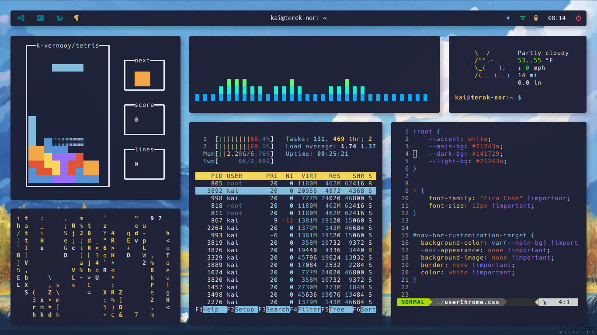
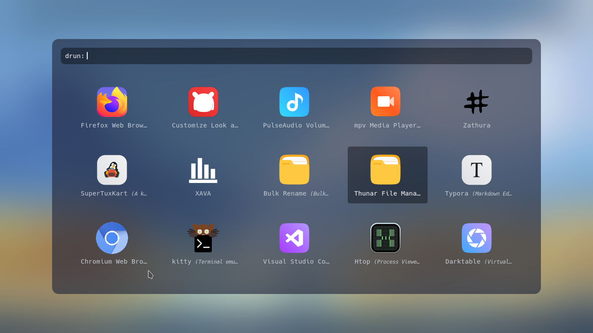

# k-vernooy/dotfiles

 

## About
My dotfile organization repository! Contains config files for my current i3/Ubuntu setup. This is currently working in **Ubuntu 20.04**, but I assume it should work (with modification) on other distros.
  
## Images
See the [reddit post](https://www.reddit.com/r/unixporn/comments/j3mfc6/i3gaps_ready_for_fall/)'s comments for some FAQ.

- WM: [i3-gaps](https://github.com/Airblader/i3)
- Compositor: [picom (ibhagwan's fork)](https://github.com/ibhagwan/picom)
- Status bar: [polybar](https://github.com/polybar/polybar)
- Notifications: [dunst](https://github.com/dunst-project/dunst)

- Terminal: urxvt
- *Applications in below image:* k-vernooy/tetris, cmatrix, cli-visualizer, htop, wttr.in, and vim

- File manager: Thunar
- GTK Theme: Modified [sweet-dark](https://www.gnome-look.org/p/1253385/)

- App launcher/menus: [rofi](https://github.com/Davatorium/rofi)

## Notes
I'll have further instructions here about how to install everything. Until I get around that, note that:

- I'm using ibhagwan's picom fork, which can be installed from its repository. This is for rounded corners and dual-kawase blur.
- This is using Airblader's i3-gaps, not vanilla i3. I had to install this from a PPA for it to work, but I'd advise you to install it the conventional way for your distro.
- I found that Rofi needed to be built from source in order to get the latest icon functionality working.
- **The install script is very rudimentary.** It likely doesn't do all it needs to, and it probably overwrites files you may not want overwritten. I'd suggest manually:
    - installing `/config/` to `$CONFIG`
    - installing `/home/` to `$HOME`
    - installing `/scripts/` to `~/Scripts/`
    - following instructions inside each `/apps/` subdir