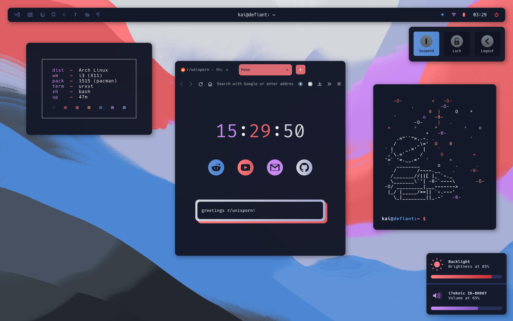
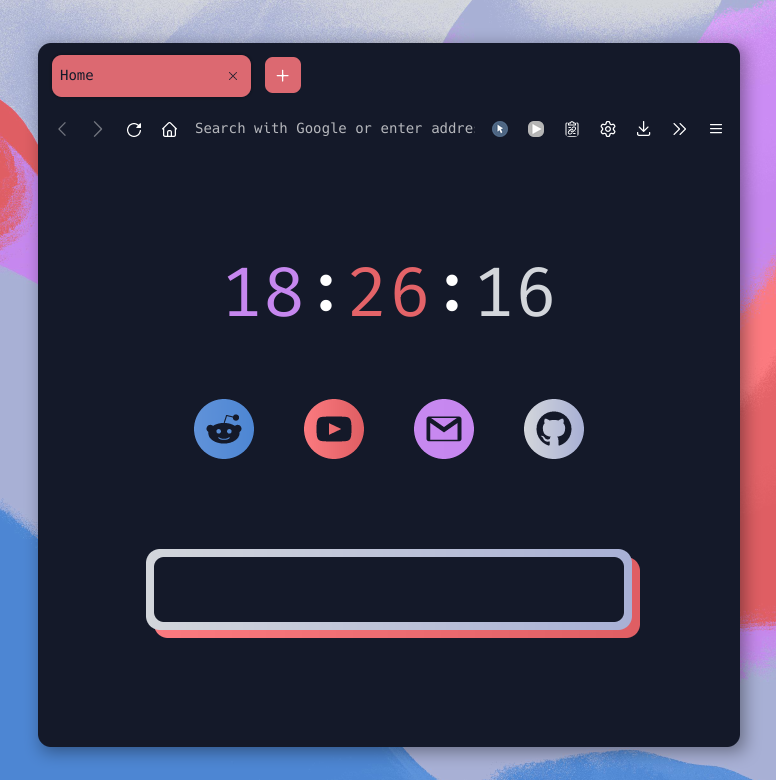
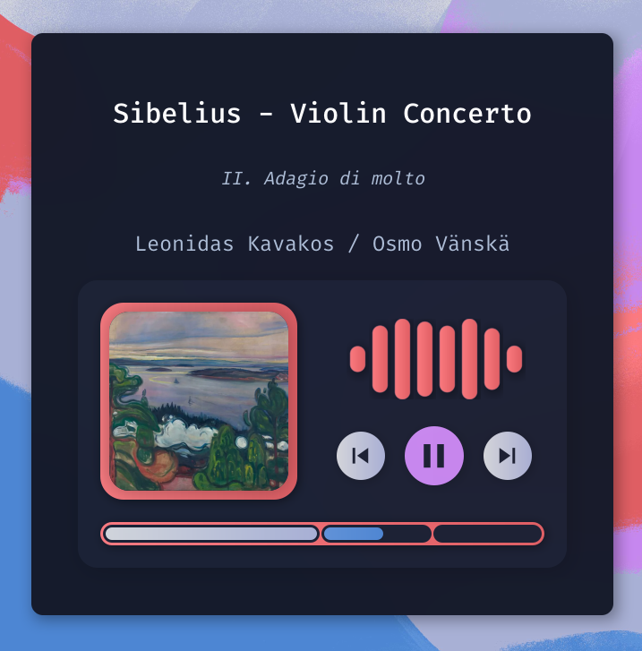
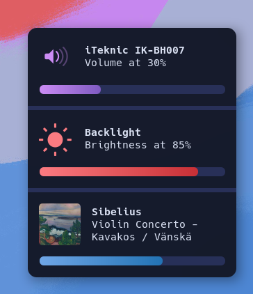

# k-vernooy/dotfiles
 

A dotfile organization repository for my current i3/Arch setup!

## About

- Window Manager: [i3-gaps](https://github.com/Airblader/i3)
- Compositor: [picom (ibhagwan's fork)](https://github.com/ibhagwan/picom)
- Status Bar: [polybar](https://github.com/polybar/polybar)
- Icon Fonts: [Hack Nerd Font](https://github.com/ryanoasis/nerd-fonts), [Material Icons](https://developers.google.com/fonts/docs/material_icons)
- Notifications: [dunst (custom fork)](https://github.com/k-vernooy/dunst)
- Terminal: Urxvt
- Launcher/system menus/filebrowser: [Rofi](https://github.com/Davatorium/rofi)
- Music system:
    - Widgets: [eww](https://github.com/elkowar/eww)
        - Visualizer: [GLava](https://github.com/jarcode-foss/glava) with custom module
    - Media player: mpv
- Fetch: [macchina](https://github.com/Macchina-CLI/macchina)
- File manager: Thunar
- PDF viewer: Zathura
- GTK Theme: Modified [sweet-dark](https://www.gnome-look.org/p/1253385/)
- VSCode theme: Modified [Night Shift](https://marketplace.visualstudio.com/items?itemName=jean.desaturated)
- Custom color scheme (see `/home/Xresources`)
- Other applications in scrots: [tetris](https://github.com/k-vernooy/tetris), [trekscii](https://github.com/k-vernooy/trekscii), cmatrix, cava, htop, wttr.in, and nvim

## Showcase & Details

#### Custom firefox theme & startpage

Styled via `userChrome.css`, new tab page set with `autoconfig.cfg`.

#### Music Player

The player window is a widget built in eww, and the visualizer is an overlayed GLava window. This music player uses a custom metadata storage system. I'm still in the process of cleaning up the script and workflow for tagging music, and when it's uploaded it will be highly specific to my use-case (primarily classical music). If you're looking for something that's likely more appropriate for your setup, I'd suggest a spotify/mpris-based music player [here](https://github.com/Syndrizzle/hotfiles#an-eww-based-music-player-popup-to-control-your-music-get-synced-lyrics-and-even-a-visualizer), also using eww.

#### Styled Notifs

The rounded/gradient progress bars are achieved with a custom fork at [k-vernooy/dunst](https://github.com/k-vernooy/dunst). The relevant changes can be found on the `progress-styling` branch, and building is as simple as `make && sudo make install` in the root directory of the repository, provided normal dunst dependencies are installed.

## Notes
- I'm using ibhagwan's picom fork, which can be installed from [this repository](https://github.com/ibhagwan/picom). This is the only fork I've found to support simultaneously rounded corners and dual-kawase blur.
- This is using Airblader's i3-gaps, not vanilla i3
- I found that Rofi needed to be built from source in order to get the latest icon functionality working; however this is likely no longer necessary
- There's no install script, because I'd suggest using these files as templates rather than directly copying them (simply because they weren't designed to be cross-platform). If you would like to use these files, you can try doing the following manually:
    - install `/config/` to `$CONFIG`
    - install `/home/` to `$HOME`
    - install `/scripts/` to `~/scripts/`
    - install `/images/wall` to `~/images/wall`
    - following instructions inside each `/apps/` subdir
